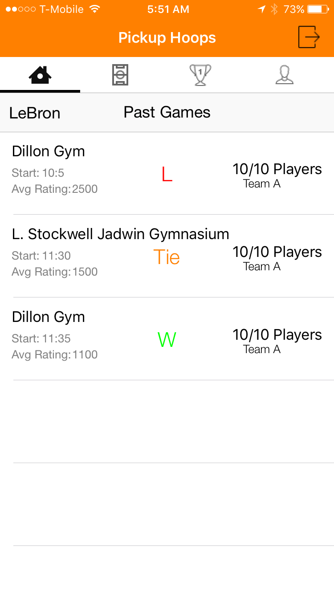
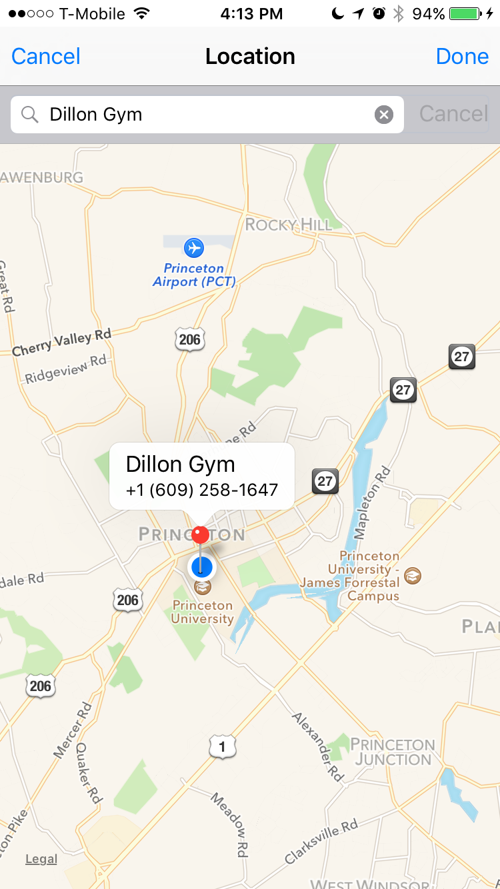

# PickupHoops

PickupHoops strives to connect local basketball players together by creating pickup games at convenient locations, while also maintaining a rating for each user. Each user has the ability to create a game. Each player can then choose to join any game based on their rating. The rating of a player is determined by their performance in each game and the outcome of the game.

Here are screenshots of the app in development.

   

